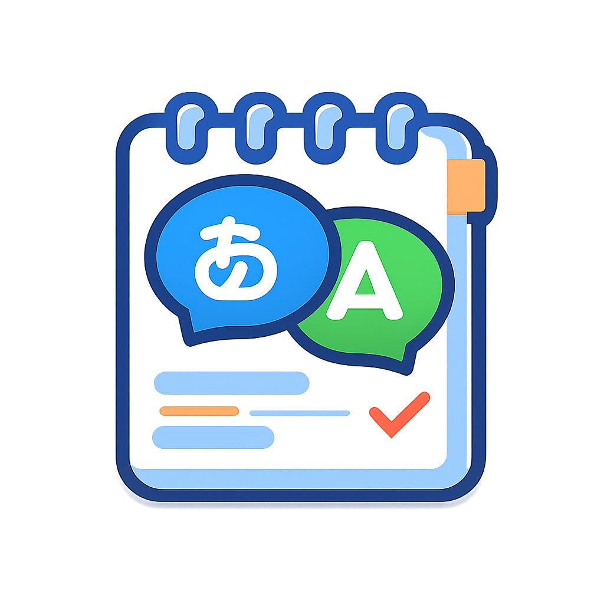

<div align="center">

# YukarinetteLogger

<p align="center">
  
</p>

<p align="center">
  <a href="./LICENSE">
    
  </a>
  
</p>
</div>

YukarinetteLogger は、ゆかりねっとコネクター Neo から送られてくる **翻訳テキスト（ja/en）を WebSocket 経由で受信し、ログとして保存する常駐アプリ**です。タスクトレイに常駐し、WebSocket の接続状態をリアルタイムに表示します。翻訳ログを後から確認したい配信者・実況者向けの補助ツールです。

---

## ✨ 主な機能

### ✔ WebSocket 受信
- ゆかりねっとコネクター Neo からの翻訳データを WebSocket で受信
- ゆかりねっとコネクター Neoの仕様に従いレジストリから WebSocket のポート番号を自動取得（DWORD の場合は `ws://127.0.0.1:PORT` として組み立て）

### ✔ MessageID ベースのログ確定処理
- 同じ MessageID のデータは上書きし、最後の1件だけをログに保存
- MessageID が変わったら前のデータを確定出力
- 一定時間更新がなければ自動で確定出力

### ✔ 翻訳ログ出力形式（例）
```
YYYYMMDD-HH:MM:SSSSS ja:日本語,en:English
```

### ✔ アプリケーションログ exe 名に合わせたグファイル名
- YukarinetteLogger.exe → YukarinetteLogger.log

### ✔ タスクトレイ常駐
- WebSocket の状態をツールチップで表示  
  - 接続待機中  
  - 接続中  
  - 受信中  
  - 再接続中  
  - 切断  
- 右クリックメニューに Exit（終了）を表示

### ✔ Windows 通知
- 起動時  
- WebSocket 接続成功時  
- 再接続失敗時  

### ✔ 終了検知
- WebSocket 切断  
- 監視プロセスが存在しない場合  

---

## 📦 インストール方法

### 1. Release から ZIP をダウンロード
```
YukarinetteLogger.zip
├─ YukarinetteLogger.exe
└─ config.json
```

### 2. 任意のフォルダに展開

### 3. config.json を編集（必要に応じて）
```json
{
  // デバッグモード（true にするとログが詳細になる）
  "DEBUG": false,

  // WebSocket のポート番号を取得するレジストリのハイブ
  // 通常は HKEY_CURRENT_USER または HKEY_LOCAL_MACHINE
  "REGISTRY_HIVE": "HKEY_CURRENT_USER",

  // WebSocket のポート番号が保存されているレジストリパス
  "REGISTRY_PATH": "SOFTWARE\\YukarinetteConnectorNeo",

  // レジストリ内の値の名前（DWORD または REG_SZ）
  // DWORD の場合はポート番号として扱い、URL を自動生成する
  "REGISTRY_VALUE": "WebSocketPort",

  // メッセージログを保存するフォルダ名
  // アプリの実行フォルダ内に作成される
  "LOG_DIR": "log",

  // 同じ MessageID の更新が止まってから確定保存するまでの秒数
  // （例：10秒間更新がなければログに書き込む）
  "PROCESS_STABLE_SEC": 10,

  // バッファの定期チェック間隔（秒）
  // この間隔で「確定してよいか」を確認する
  "FLUSH_INTERVAL_SEC": 5,

  // WebSocket 切断時の再接続までの待機秒数
  "WS_RECONNECT_DELAY_SEC": 5,

  // 再接続を試みる最大時間（秒）
  // この時間を超えるとアプリは終了する
  "WS_MAX_RECONNECT_SEC": 60,

  // 監視プロセス名
  "TARGET_PROCESS": "YNC_Neo.exe"
}
```
### config.json の各項目について

| 項目名 | 説明 |
|--------|------|
| `DEBUG` | デバッグモード。true にするとログが詳細になる。 |
| `REGISTRY_HIVE` | WebSocket のポート番号を取得するレジストリのハイブ。通常は `HKEY_CURRENT_USER`。 |
| `REGISTRY_PATH` | WebSocket のポート番号が保存されているレジストリパス。 |
| `REGISTRY_VALUE` | レジストリ内の値の名前。DWORD の場合はポート番号として扱う。 |
| `LOG_DIR` | メッセージログを保存するフォルダ名。アプリの実行フォルダ内に作成される。 |
| `PROCESS_STABLE_SEC` | 同じ MessageID の更新が止まってから確定保存するまでの秒数。 |
| `FLUSH_INTERVAL_SEC` | バッファの定期チェック間隔（秒）。 |
| `WS_RECONNECT_DELAY_SEC` | WebSocket 切断時の再接続までの待機秒数。 |
| `WS_MAX_RECONNECT_SEC` | 再接続を試みる最大時間（秒）。超えるとアプリは終了する。 |
| `TARGET_PROCESS` | 監視プロセス名。 |


### 4. YukarinetteLogger.exe を起動  
タスクトレイにアイコンが表示されます。

---

## 📝 レジストリ設定について

ゆかりねっとコネクター Neoの仕様に従いWebSocket のポート番号はレジストリから取得します。
HKCU\Software\YukarinetteConnectorNeo\WebSocket

### ✔ DWORD（数値）
ポート番号として扱い、以下の URL を自動生成します。
```
ws://127.0.0.1:{PORT}
```

---

## 🛠 ビルド方法（開発者向け）

### 1. 依存関係をインストール
```
pip install -r requirements.txt
```

### 2. PyInstaller でビルド
```
pyinstaller --onefile --noconsole --name YukarinetteLogger main.py
```

### 3. config.json を dist フォルダへコピー
```
copy config.json dist\
```

---

## 🚀 GitHub Actions（自動ビルド & Release）

- タグ（例：v1.0.0）を push すると自動ビルド  
- YukarinetteLogger.exe と config.json を ZIP 化  
- YukarinetteLogger.zip として Release にアップロード  

---

## 📄 ライセンス

MIT License

---

## 🙏 作者より

このツールは、ゆかりねっとコネクター Neo をより便利に使うための **翻訳ログ保存専用アプリ**として開発されました。改善案・要望・バグ報告などあれば Issue へどうぞ。
